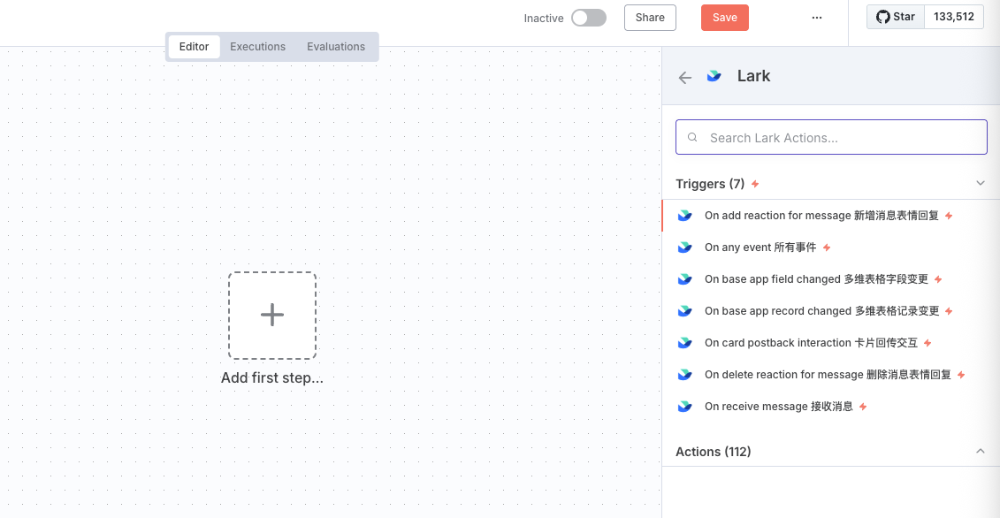
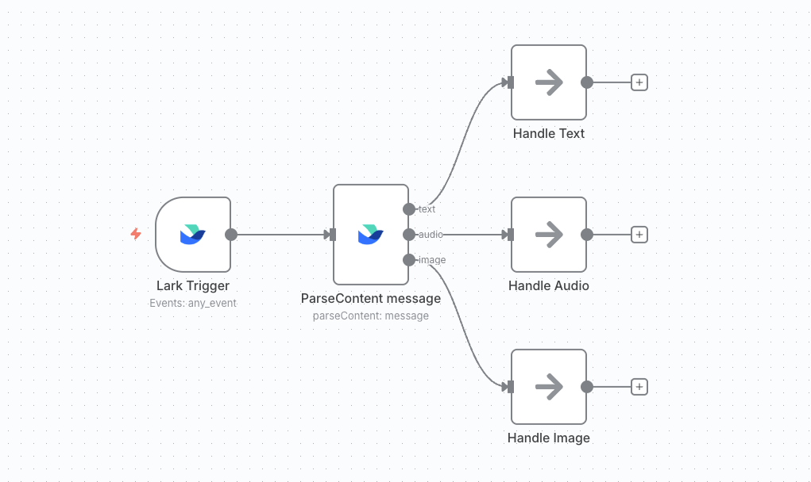
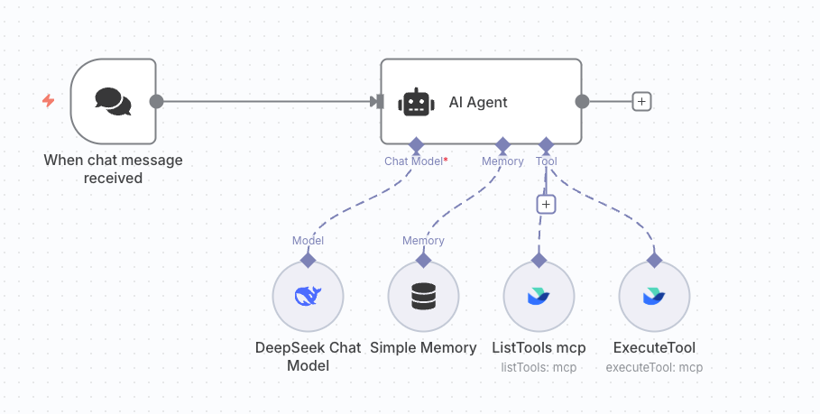

[中文](https://github.com/zhgqthomas/n8n-nodes-feishu-lark/blob/main/README.md)

# n8n-nodes-feishu-lark

This project is a secondary development based on [n8n-nodes-feishu-lite](https://github.com/other-blowsnow/n8n-nodes-feishu-lite). We thank the original author for their open-source contribution. Building on the original functionality, we have added `LarkTrigger` and `LarkMCP` nodes along with some operational optimizations.

# Usage Tutorial

## Credentials

When calling Feishu Open Platform OpenAPI, you may need to use `tenant_access_token` or `user_access_token`.

`tenant_access_token` represents using the application's identity to operate OpenAPI. The scope of data resources that the API can operate is limited to the resource scope that the application's identity can operate.

`user_access_token` represents using the application user's identity to operate OpenAPI. The scope of data resources that the API can operate is limited to the resource scope that the user's identity can operate.

### Tenant Token Configuration

In the Add new credential options, select `Lark Tenant Token API`, and fill in the `App ID` and `App Secret` from the Feishu application backend into the corresponding input boxes in the image.

> For how to obtain `App ID` and `App Secret`, please refer to Feishu's [official documentation](https://open.feishu.cn/document/server-docs/api-call-guide/terminology).

### User Token Configuration

In the Add new credential options, select `Lark OAuth2 API`, and fill in the `App ID` and `App Secret` from the Feishu application backend into the corresponding `Client ID` and `Client Secret` input boxes in the image.

The `OAuth Redirect URL` in the above image needs to be configured in the Feishu application backend. The specific path is to open the application details page, select `Security Settings`, and you can see the place to set the `Redirect URL`.

OAuth2.0 authentication requires setting the corresponding Scope permissions. You need to enable the corresponding permissions in the `Permission Management` option in the Feishu application backend, and then input the permission names in a specific format into the `Scope` input box of `Lark OAuth2 API`.

For example, if you need to authorize offline data access and create multi-dimensional table permissions, you first need to go to `Permission Management` in the application backend, click `Enable Permissions`, and select offline data access and create multi-dimensional table in the popup options to enable the corresponding permissions. Then input the Scope names `base:app:create,offline_access` into the Scope input box in `Lark OAuth2 API`. After clicking save, the Feishu authentication page will pop up.

> It is recommended to enable `offline_access` permission so that n8n can automatically update expired access tokens through refresh tokens.

## Triggers

Through event subscription, n8n applications can respond promptly to change events in Feishu. When events occur, the open platform will send event messages according to the configured subscription method.

### Websocket

**Websocket is the recommended way to receive events in Feishu, but it currently only applies to the Chinese version of Feishu. The international version of Lark can only choose the Webhook method to receive events.**

By searching for and clicking Lark on a blank n8n canvas, the Trigger option will automatically appear. This Trigger uses the Websocket connection method.

`Lark Trigger` uses `tenant_access_token` to receive event pushes sent by Feishu, so you must configure the `Lark Tenant Token API` Credential in advance.

`Any Event` can accept all events from Feishu without having to select a specific event individually. However, you still need to add the corresponding events in the `Events & Callbacks` option in the Feishu backend before the application can normally receive the corresponding event notifications.

> For the configuration method of Websocket connection in the Feishu backend, please refer to Feishu's [official documentation](https://open.feishu.cn/document/server-docs/event-subscription-guide/event-subscription-configure-/request-url-configuration-case).

### Webhook

The Webhook method of receiving Feishu events is implemented using the `parse webhook` operation combined with n8n's official `Webhook` and `Respond to Webhook`.

The source code provides a Webhook Workflow [demonstration file](https://github.com/zhgqthomas/n8n-nodes-feishu-lark/blob/main/demo/webhook_workflow.json) that can be directly imported into n8n for use.

> For the configuration method of Webhook connection in the Feishu backend, please refer to Feishu's [official documentation](https://open.feishu.cn/document/event-subscription-guide/event-subscriptions/event-subscription-configure-/choose-a-subscription-mode/send-notifications-to-developers-server).

## Custom Operations

### Parse Message

Parse the data structure of Feishu's event callbacks and perform branch processing according to different event types.

> Check Feishu's [official documentation](https://open.feishu.cn/document/server-docs/im-v1/message-content-description/message_content) to understand different message content types.

### Send and Wait

By selecting the `Send and Wait` operation, the application will send a message to Feishu and pause the workflow execution until someone confirms the operation or provides more information.

> This Operation can be used to implement Human in the loop strategy mechanisms.

### Send Streaming Message

In n8n version 1.3.0, [Streaming capability was added to `Webhook node` and `AI Agent node`](https://docs.n8n.io/release-notes/#n8n11030). The `Send Streaming Message` node pushes the AI Agent's output in streaming form to Feishu bots by calling the Webhook node. The effect is shown below.

> [Demo json file](https://github.com/zhgqthomas/n8n-nodes-feishu-lark/blob/main/demo/send_streaming_message.json)

### MCP node

The `listTool` and `executeTool` operations call Feishu's official lark-openapi-mcp open source library to enable AI Agent to call Feishu OpenAPI through the MCP protocol. Additionally, a specific Credential has been added for MCP Operations to enable MCP to use user tokens for Feishu API calls. [Demo json file](https://github.com/zhgqthomas/n8n-nodes-feishu-lark/blob/main/demo/lark_mcp.json)

> For more information about lark-openapi-mcp, please refer to [Feishu's official documentation](https://open.feishu.cn/document/uAjLw4CM/ukTMukTMukTM/mcp_integration/mcp_introduction)

## License

MIT Licenses

## Links

- [Project Homepage](https://github.com/zhgqthomas/n8n-nodes-lark-feishu)
- [Feishu Open Platform Documentation](https://open.feishu.cn/document/)
- [n8n Community Nodes Documentation](https://docs.n8n.io/integrations/community-nodes/)

## Star History

