[English](https://github.com/zhgqthomas/n8n-nodes-feishu-lark/blob/main/README-EN.md)

# n8n-nodes-feishu-lark

本项目是基于 [n8n-nodes-feishu-lite](https://github.com/other-blowsnow/n8n-nodes-feishu-lite) 之上进行的二次开发，感谢原作者的开源贡献。在原有功能基础上，增加了 `LarkTrigger` 和 `LarkMCP` 节点以及一些操作上的优化。

# 使用教程

## Credentials

在调用飞书开放平台 OpenAPI 时，可能会用到 `tenant_access_token`、`user_access_token`。

`tenant_access_token` 代表使用应用的身份操作 OpenAPI，API 所能操作的数据资源范围受限于应用的身份所能操作的资源范围。

`user_access_token` 代表使用应用的使用者的身份操作 OpenAPI，API 所能操作的数据资源范围受限于用户的身份所能操作的资源范围。

### Tenant Token 配置

在 Add new credential 的选项里选择 `Lark Tenant Token API`，将飞书应用后台里的 `App ID` 和 `App Secret` 依次填入到图片中的输入框里即可。
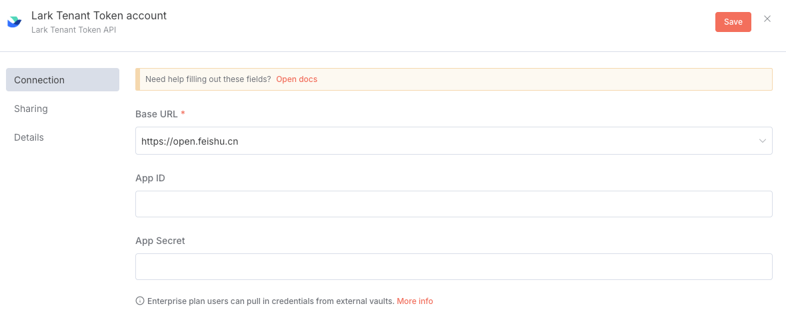

> `App ID` 和 `App Secret` 的获取方法，请查看飞书的[官方文档](https://open.feishu.cn/document/server-docs/api-call-guide/terminology)。

### User Token 配置

在 Add new credential 的选项里选择 `Lark OAuth2 API`，将飞书应用后台里的 `App ID` 和 `App Secret` 依次填入到图片中的输入框里对应的 `Client ID` 和 `Client Secret`。
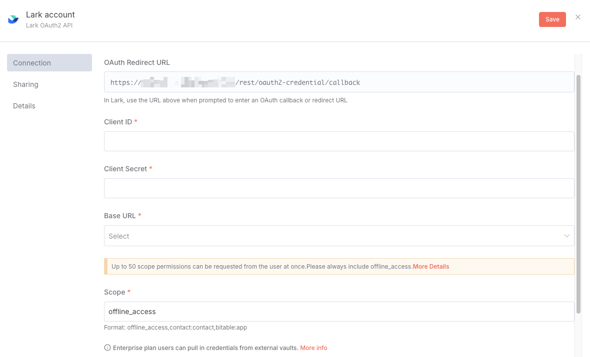

上图中的 `OAuth Redirect URL` 需要配置在飞书的应用后台当中。具体路径为打开应用的详情页面，选择`安全设置`，即可看见设置`重定向 URL`的地方。
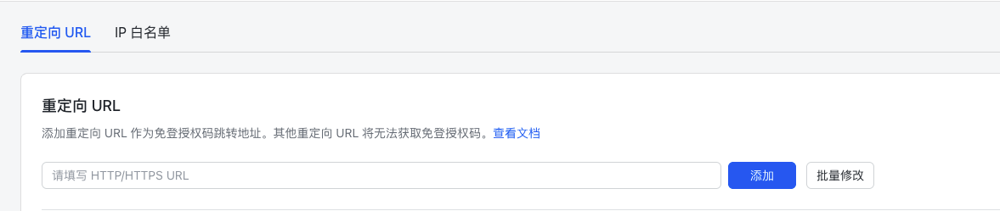

OAuth2.0 的认证方式里是需要设置权限的对应 Scope 有哪些，需要在飞书的应用后台的`权限管理`选项里，开通对应的权限后，将权限名称以特定的格式输入到`Lark OAuth2 API` 的 `Scope` 输入框里。

例如，需要授权离线访问数据和创建多维表格的权限，首先要在应用后台的`权限管理`，点击`开通权限`，在弹出的选项当中选择离线访问数据和创建多维表格，开通对应的权限。然后将 Scope 的名称 `base:app:create,offline_access` 输入到 `Lark OAuth2 API` 中的 Scope 输入框中。点击保存后，会弹出飞书的认证页面。
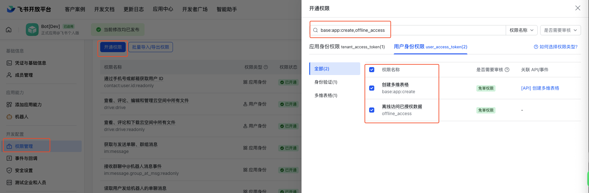

> 建议开通 `offline_access` 的权限，以方便 n8n 可以通过 refresh token 来自动对过期的 access token 进行更新

## Triggers

通过事件订阅，n8n 应用可以及时响应飞书中的变更事件。当事件发生时，开放平台会按照配置的订阅方式发送事件消息。

### Websocket

**Websocket 是飞书推荐的接收事件的方式，但是目前只适用于中国版的飞书，国际版的 Lark 只能选择 Webhook 的方式来接收事件。**

通过在空白的 n8n canvas 上搜索并点击 Lark 后，会自动出现 Trigger 的选项，该 Trigger 使用的就是 Websocket 链接方式
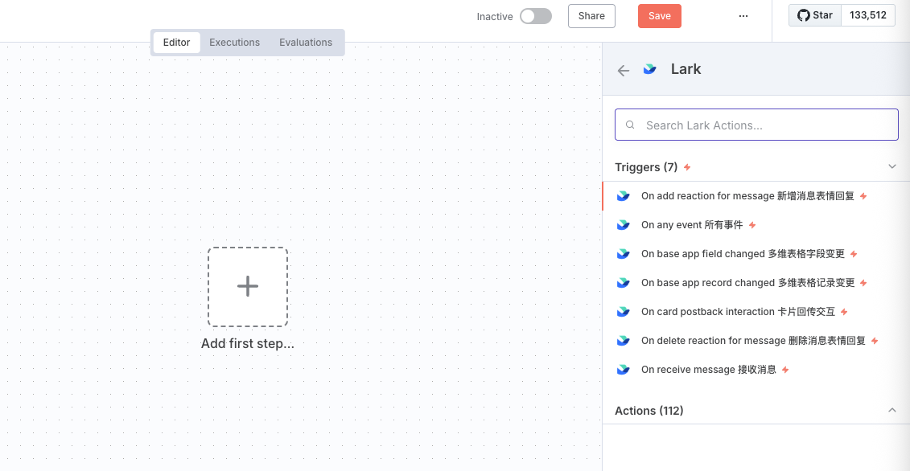

`Lark Trigger` 是使用 `tenant_access_token` 来接收飞书发送的事件推送因为必须提前配置好 `Lark Tenant Token API` 的 Credential.
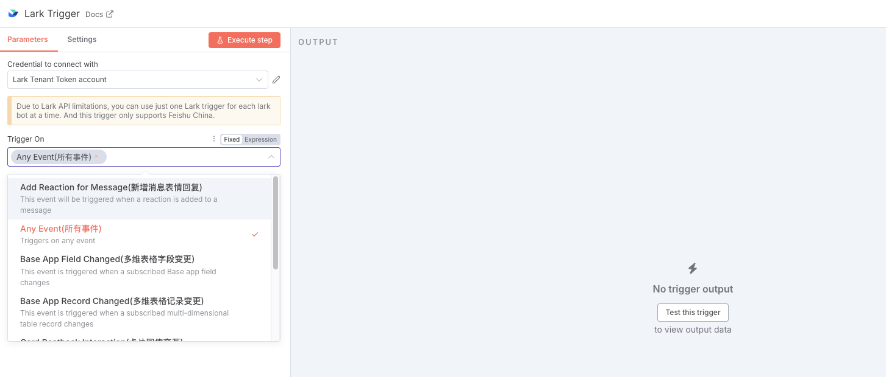

`Any Event` 是可以接受所有的来自飞书的事件，而无需单独选择某个特定的事件。但是依旧需要在飞书后台的`事件与回调`的选项里添加对应的事件后，应用才可以正常收到对应的事件通知。

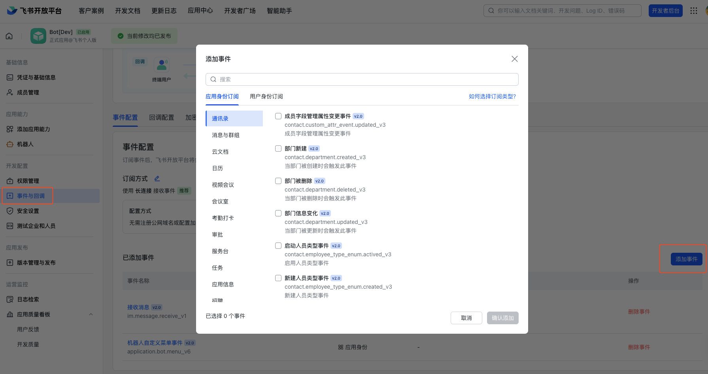

> 关于 Websocket 连接方式在飞书后台的配置方法，请查看飞书[官方文档](https://open.feishu.cn/document/server-docs/event-subscription-guide/event-subscription-configure-/request-url-configuration-case)。

### Webhook

Webhook 接收飞书的事件方式是使用 `parse webhook` operation 然后搭配 n8n 的官方 `Webhook` 和 `Respond to Webhook` 来实现的。

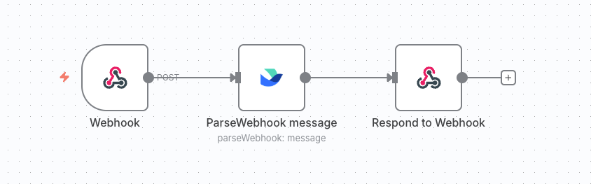

源码当中提供了 Webhook 的一个 Workflow 的[演示文件](https://github.com/zhgqthomas/n8n-nodes-feishu-lark/blob/main/demo/webhook_workflow.json)，可以直接导入到 n8n 当进行使用。

> 关于 Webhook 连接方式在飞书后台的配置方法，请查看飞书[官方文档](https://open.feishu.cn/document/event-subscription-guide/event-subscriptions/event-subscription-configure-/choose-a-subscription-mode/send-notifications-to-developers-server)。

## 自定义的 Operations

### Parse Message

对飞书的事件回调数据结构进行解析，并根据不同的事件类型进行分支处理
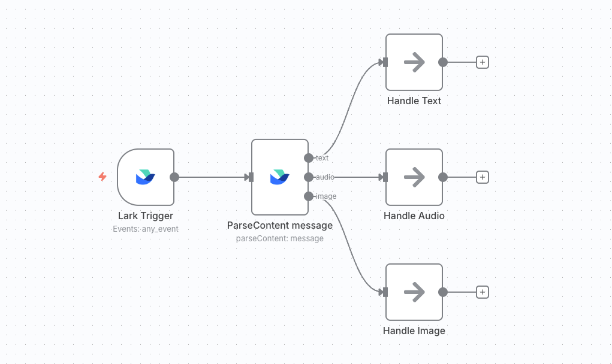

> 查看飞书[官方文档](https://open.feishu.cn/document/server-docs/im-v1/message-content-description/message_content)了解不同的消息内容类型。

### Send and Wait

通过选择 `Send and Wait` 操作，应用会发送一个消息到飞书，并暂停工作流的执行，直到有人确认该操作或提供更多信息。

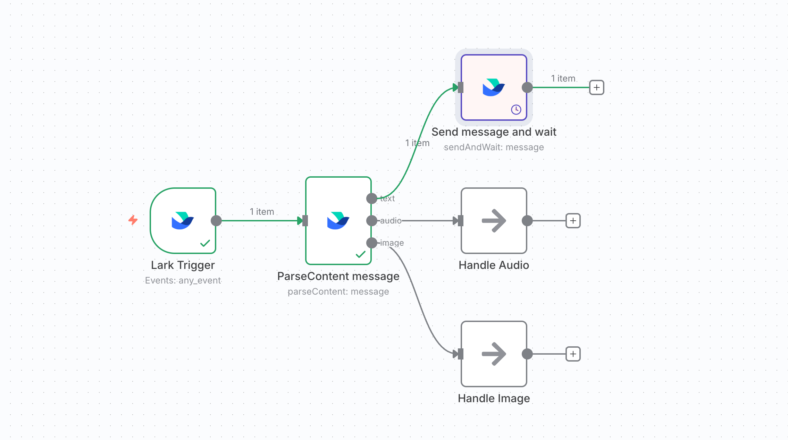

> 可以通过该 Operation 来实现 Human in the loop 的策略机制。

### Send Streaming Message

n8n 在 1.3.0 版本当中，[为 `Webhook node` 和 `AI Agent node` 添加了 Streaming 的能力](https://docs.n8n.io/release-notes/#n8n11030)。`Send Streaming Message` node 通过调用 Webhook node 将 AI Agent 的 output 以 Streaming 的形式，推送给飞书机器人。效果如下所示。

> [Demo json 文件](https://github.com/zhgqthomas/n8n-nodes-feishu-lark/blob/main/demo/send_streaming_message.json)

### MCP node

`listTool` 和 `executeTool` 两个 Operation，会调用飞书官方的 lark-openapi-mcp 开源库，实现 AI Agent 通过 MCP 协议调用飞书 OpenAPI。并且为 MCP Operation 添加了特有的 Crediential 以实现 MCP 可以使用 user token 进行飞书 API 的调用。[Demo json 文件](https://github.com/zhgqthomas/n8n-nodes-feishu-lark/blob/main/demo/lark_mcp.json)

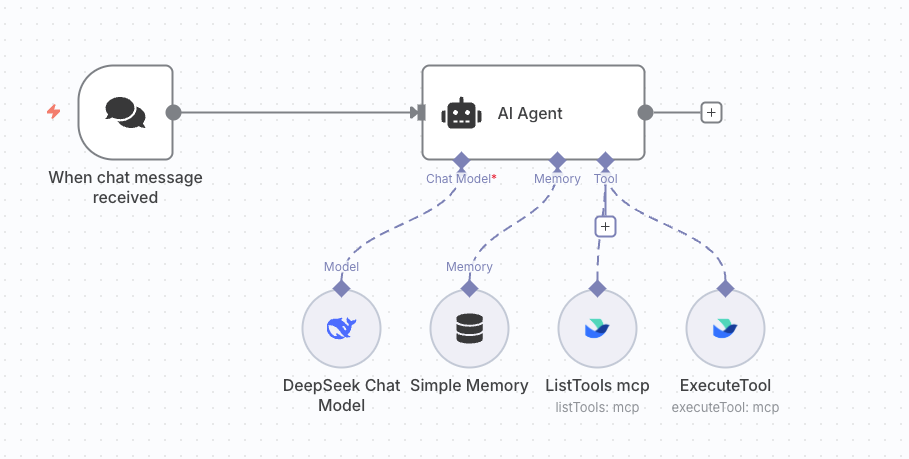

> 关于 lark-openapi-mcp 更多的介绍，请查看[飞书官方文档](https://open.feishu.cn/document/uAjLw4CM/ukTMukTMukTM/mcp_integration/mcp_introduction)

## 许可证

MIT License

## 链接

- [项目主页](https://github.com/zhgqthomas/n8n-nodes-lark-feishu)
- [飞书开放平台文档](https://open.feishu.cn/document/)
- [n8n 社区节点文档](https://docs.n8n.io/integrations/community-nodes/)

## Star History

